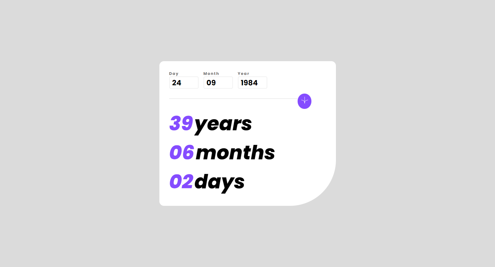

# Age Calculator App

## Overview

The Age Calculator App is a user-friendly tool designed to calculate and display the age in years, months, and days based on the input date provided by the user. Built with HTML, CSS, and JavaScript, it features a simple yet effective interface that guides users through entering their birth date.

## Features

- **Responsive Layout:** Adapts to different device screens, ensuring accessibility and user-friendliness.
- **Input Validation:** JavaScript validates the input fields for day, month, and year, displaying error messages for invalid or incomplete inputs.
- **Real Time Calculations:** Calculates the age in years, months, and days from the provided birth date to the current date, offering precise results.
- **Error Handling:** Displays informative error messages for common input errors, such as invalid dates or future dates.

## Screenshots




## Setup

To use this component in your project, follow these steps:

1. **Clone the Repository:**

```bash
git clone https://github.com/Wilmer856/age-calculator-app.git
```

2. **Navigate to the Project Directory:**

```bash
cd age-calculator-app-main
```

3. **Open the `index.html` file in a web browser to view the component.**

## Customization

- **Functionality Enhancements:** Update the script.js file to add new features or improve existing ones, such as adding leap year support or more detailed error messages.
- **Localization:** Adjust the text and error messages to support multiple languages or regions.
- **Styling:** Modify the 'style.css' file to change the app's appearance, aligning it with your branding or design preferences.
